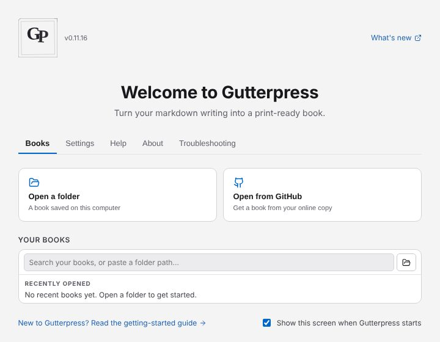

# Install the app and open it for the first time

## Download

Download the file for your computer from the
[install page](https://gutterpress.dimm.city/install/#desktop-app):

- **Windows:** the installer, `Gutterpress-setup-win-x64.exe`. It installs for your user only,
  needs no administrator rights, and adds Start Menu and Desktop shortcuts. The portable `.zip`
  runs without installing.
- **macOS:** the `.dmg` for Apple Silicon or for Intel. Open it and drag Gutterpress to
  Applications.
- **Linux:** the `.AppImage`. Make it executable (`chmod +x`) and run it.

There is no ARM64 build for Windows (the x64 app runs under emulation) or for Linux.

## Get past the first-run warning

The app is not signed yet, so macOS and Windows warn you the first time you open it.

- **macOS:** try to open the app once, then open **System Settings → Privacy & Security**, find
  Gutterpress, and choose **Open Anyway**.
- **Windows:** if you see "Windows protected your PC", choose **More info → Run anyway**.

To check that the file is the one we published, compare it with `SHA256SUMS.txt` on the release
(`shasum -a 256 <file>` on macOS, `sha256sum <file>` on Linux,
`Get-FileHash <file> -Algorithm SHA256` in PowerShell).

## The start screen

Gutterpress opens on the start screen. The first time, it says **Welcome to Gutterpress**; after
that it offers **Open your book** to carry on where you left off. Its tabs are **Books**,
**Settings**, **Help**, **About** and **Troubleshooting**.

On first launch the app copies the user guide and some example books into a `Gutterpress` folder
in your Documents folder. They are listed under **Discovered** on the Books tab: open one to look
around.

## Switch to Author

A new install starts as a **Reader**: just the pages, with Edit, Setup and Publish out of the
way. To write, open the **Settings** tab and under **App → How you use Gutterpress** choose
**Author** — "Write and set up your book, then publish it."

Next: [create a new book, or open one](02-books.md).
