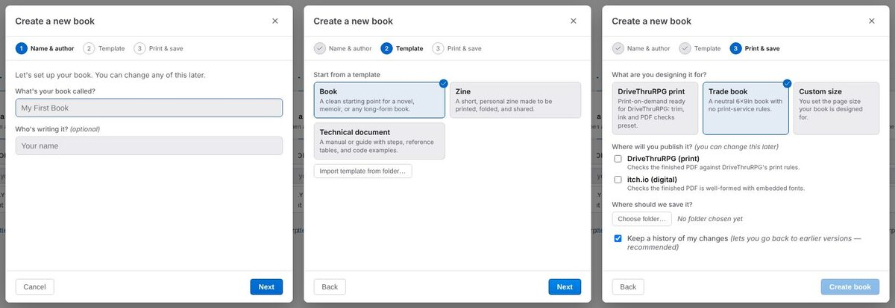

# Create a new book, or open one

Everything starts on the **Books** tab of the start screen. Click the folder button at the left
of the status bar ("Books — open the start screen") to get back to it from a book.

## Create a new book

Creating books is for authors: if you don't see it, [switch to Author](01-install.md#switch-to-author).

1. On the Books tab, choose **Create a new book**.
2. **Name & author:** type the book's name under "What's your book called?" and, if you like,
   your name.
3. **Template:** pick a starting point — **Book** (a novel, memoir or any long-form book),
   **Zine**, or **Technical document** — or one of your own saved templates.
4. **Print & save:**
   - Under **What are you designing it for?** choose **DriveThruRPG print**, **Trade book**
     (a neutral 6×9in book), or **Custom size** and then a page size (US Letter, Trade paperback,
     Digest, A4, A5, or your own width and height).
   - Under **Where will you publish it?** tick DriveThruRPG and/or itch.io. You can change this
     later.
   - Under **Where should we save it?** click **Choose folder…**.
   - Leave **Keep a history of my changes** ticked. It keeps earlier versions of your book on your
     computer, with no account needed (see
     [Keep versions and back up your work](09-versions-and-backup.md)).
5. Click **Create book**.

## Open a book on this computer

On the Books tab, choose **Open a folder** and pick the book's folder. You can also paste a
folder path into the search box above **Your books** and click **Open**.

If the folder isn't set up as a book yet, Gutterpress offers **Set up as a book**, which lets you
edit its design and keep a history of changes. **Not now** opens it as it is.

## Open a book from GitHub

1. On the Books tab, choose **Open from GitHub**.
2. Click **Connect GitHub**, then enter the code Gutterpress shows on the GitHub page that opens.
3. Choose the repository. If it holds more than one book, choose the book.
4. Pick the version to open, a name, and where to save it on your computer, then open it.

## Find your books again

The **Your books** list on the Books tab has **Currently open**, **Favorites**, **Recently
opened** and **Discovered** sections, and a search box. Click a book's star to add it to
Favorites; the X on a recent book takes it off the list (the book itself is not touched). A book
whose folder has moved shows **Not found**.

The book switcher next to the folder button in the status bar switches between books.

Next: [write and preview your book](03-write-and-preview.md).
