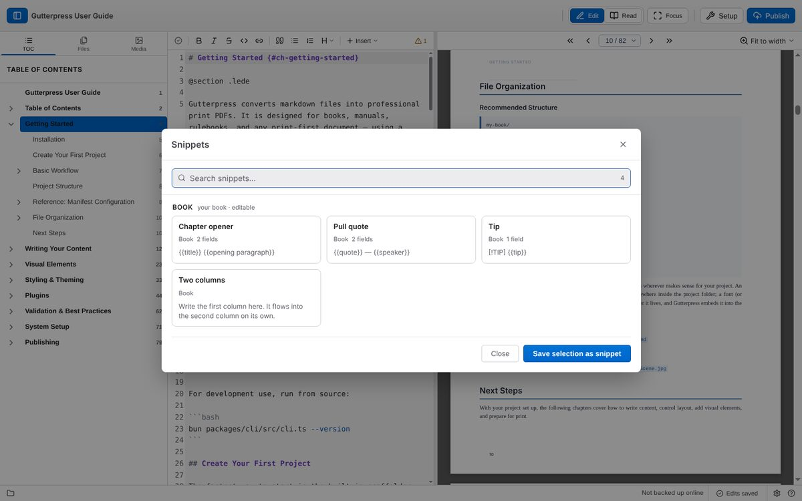
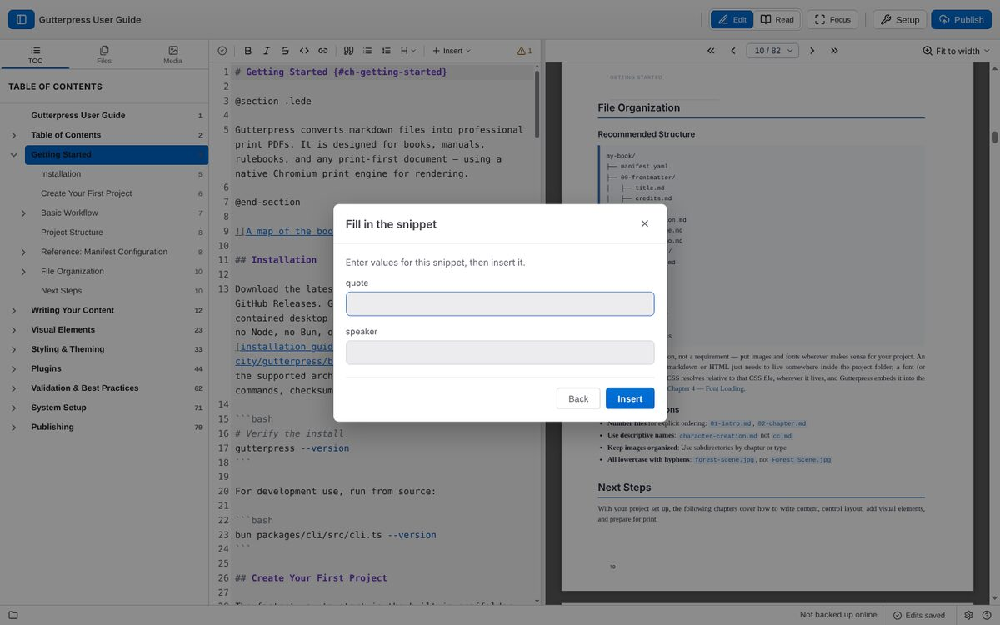

# Insert snippets and components

A **snippet** is a piece of markdown you can insert again and again. Snippets come from three
places: your book, the extensions it uses, and Gutterpress itself.

## Insert a snippet

1. Put the cursor where the snippet should go.
2. Press **Ctrl+Shift+S** (Cmd+Shift+S on a Mac), or choose **Insert → Insert snippet** in the
   editor toolbar.
3. Type in the search box to filter by name or content. The chips narrow the list to **Book**,
   **Extension** or **Core** snippets, or to **Components only**.
4. Press **Enter** to insert the first match, or click a card. The arrow keys move between cards.

If the snippet has fields to fill in, Gutterpress asks for them under **Fill in the snippet**;
enter the values and click **Insert**.

## Insert a component with @

Type `@` at the start of a line to see the layout markers (`@chapter`, `@section`, `@page`,
`@spread`, `@page-break` and the rest) and the components your book's plugins add. Keep typing to
narrow the list: `@sk` offers `@skill` and each of its variants. Choosing a component inserts its
example, ready to fill in.

## Save your own snippet

Select some text in the editor, open the snippet picker, and choose **Save selection as
snippet**. Give it a name under **Snippet name** and click **Save snippet**. Your book's snippets
can be deleted from the picker with the trash icon; snippets from extensions and Gutterpress are
read-only.

Next: [change your book's design](05-design.md).
