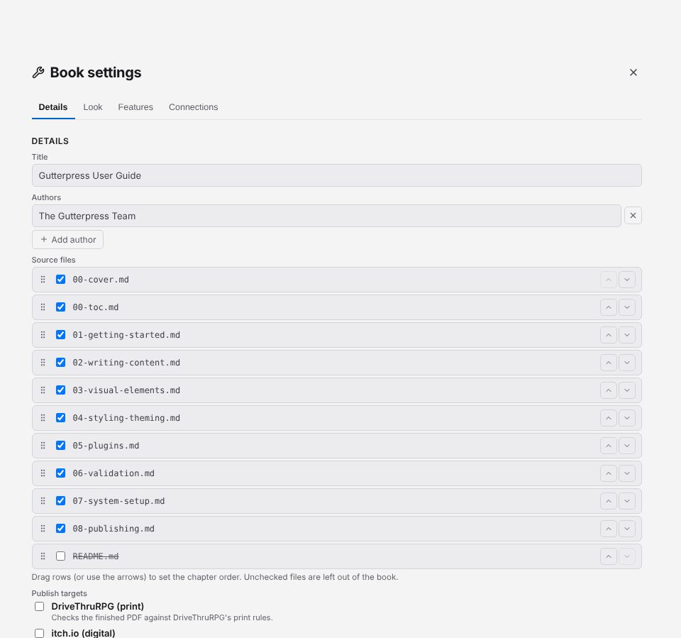
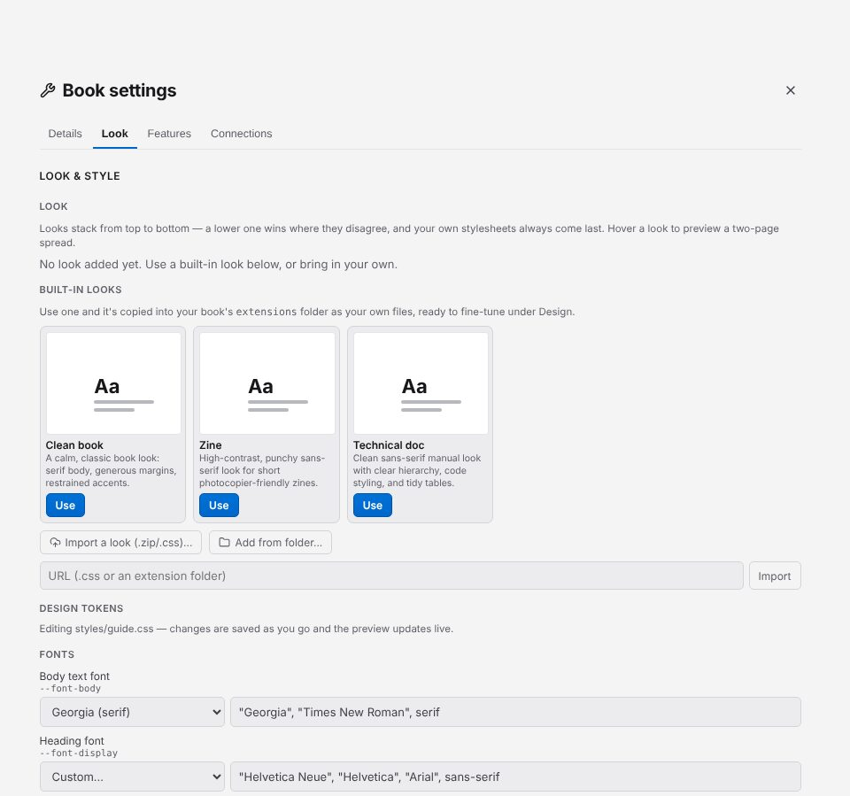

# Change your book's design

Click **Setup** (the wrench) in the toolbar to open **Book settings**. Its tabs are **Details**,
**Look**, **Features** and **Connections**. Close it with the X or Esc.

## Title, authors and chapter order

On the **Details** tab:

- set the **Title** and **Authors** (**Add author** adds another);
- under **Source files**, tick the files that belong in the book and drag them, or use **Move
  up** and **Move down**, to set the order of chapters;
- under **Page size**, choose what the book is designed for: **DriveThruRPG print**, **Trade
  book** (a neutral 6×9in book), or **Custom size** and then a size (US Letter, Trade paperback,
  Digest, A4, A5, or your own width and height in inches). These are the same choices as when you
  [create the book](02-books.md#create-a-new-book). The settings open on the book's current size;
- under **Publish targets**, tick where you plan to publish.

Click **Save details**. **Save as template…** saves this book's setup as a template you can start
new books from.

## Choose a look

A *look* is a complete design for a book. On the **Look** tab, under **Built-in looks**, click
**Use** on **Clean book**, **Technical doc** or **Zine**. Looks you have added are listed under
**Look**, where each can be turned off, moved up or down, or removed.

To use a look from elsewhere, choose **Import a look (.zip/.css)...**, **Add from folder...**, or
paste a URL into the URL field and click **Import**. [Find plugins](https://gutterpress.dimm.city/plugins/)
lists looks and other extensions on npm.

## Fine-tune fonts, colours and sizes

Under **Design tokens** on the Look tab, the settings your look offers are grouped into **Fonts**,
**Colors**, **Sizes & numbers** and **Other**. Change a value and the preview follows; Gutterpress
saves the change for you. **Revert** puts a value back; **Edit raw CSS** opens the stylesheet the
values are written to.

## Edit stylesheets

Under **Stylesheets**, each of the book's stylesheets can be turned on or off, and **Edit** opens
it in the editor. The [styling chapter](https://gutterpress.dimm.city/docs/styling-theming/)
covers what a stylesheet can do.

## Change the page size

Page size is on the **Details** tab (see above), and you can change it at any time. When you
click **Save details**, Gutterpress updates two things together: the size your book prints at
(the `@page` rule in your stylesheet, edited in place, with the rest of the file left exactly as
it was) and the size your finished PDF is checked against. If your stylesheet has no page size
yet, a small page rule is added to the end of your book's own stylesheet. If a stylesheet and
the book disagree, Details says so and Save makes them match.

Choosing **DriveThruRPG print** or **Trade book** uses that preset's page size and print
checks. It does not change which **Publish targets** are ticked.

Next: [add plugins and formatting extras](06-plugins.md).
