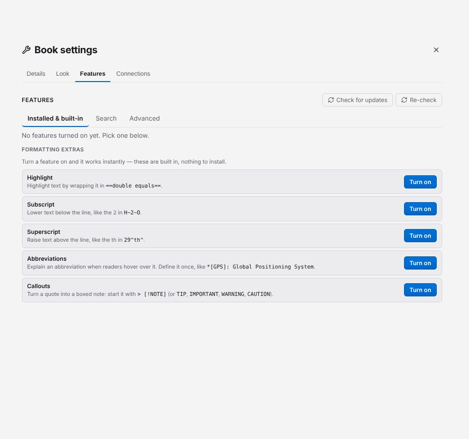
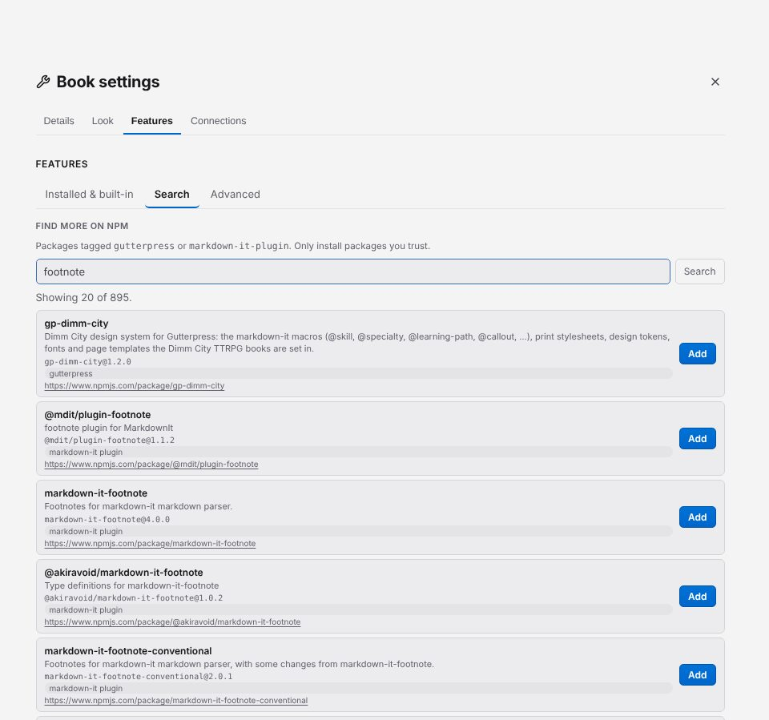

# Add plugins and formatting extras

Plugins add new markdown to your book: highlights, callouts, footnote styles, a game's components
and more. Open **Setup → Features**. Its tabs are **Installed & built-in**, **Search** and
**Advanced**.

## Turn on a formatting extra

Five extras are built in, with nothing to download. Under **Formatting extras** on the
**Installed & built-in** tab, click **Turn on** next to one, and it works straight away:

| Extra | Type |
| --- | --- |
| Highlight | `==text==` |
| Subscript | `H~2~O` |
| Superscript | `29^th^` |
| Abbreviations | `*[GPS]: Global Positioning System` |
| Callouts | `> [!NOTE]`, `> [!TIP]`, `> [!IMPORTANT]`, `> [!WARNING]`, `> [!CAUTION]` |

## Find and install a plugin

1. Open the **Search** tab ("Find more on npm"). It searches npm for Gutterpress extensions and
   markdown-it plugins.
2. Type what you are looking for (for example `footnote` or `callout`) and click **Search**.
3. Click **Add** on the one you want.

Gutterpress downloads it, checks it, keeps a copy inside your book, and lists it under
**Installed & built-in**. Your book then builds from that copy, even offline. You can also browse
the same search on the [Find plugins](https://gutterpress.dimm.city/plugins/) page.

If you know the package's name, open **Advanced**, type it under **Install from npm** (with a
version if you want one, such as `markdown-it-highlightjs@4.3.0`) and click **Install**.
**Add a plugin file or folder...** adds a plugin you have on your computer.

## Choose a version and stay up to date

Each installed plugin on **Installed & built-in** has a **Version** menu; pick a version to
switch to it. If the new version fails to download or load, your book keeps the old one.

- **Check for updates** asks npm for newer versions. A plugin with one shows the new version and
  an **Update** button.
- **Include pre-release versions** adds alpha, beta and release-candidate versions to the menus
  and the update check. It is off by default and applies to every book.
- **Install** (or **Reinstall**) appears when a plugin's copy is missing or won't load.
- Each plugin can be turned off, or removed with the trash icon, which deletes its downloaded
  copy.

The [plugins chapter](https://gutterpress.dimm.city/docs/plugins/) covers ordering plugins and
writing your own.

Next: [save a PDF](07-export-pdf.md).
