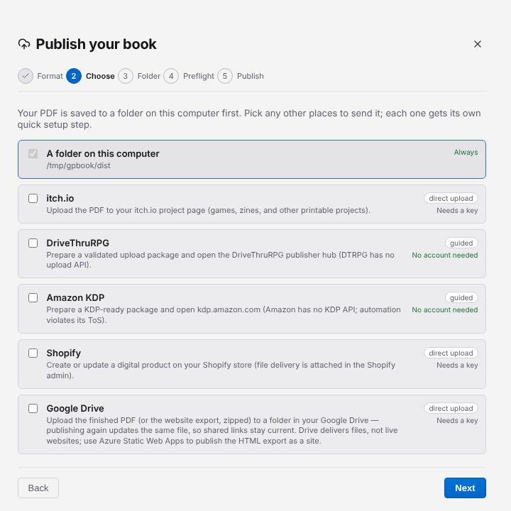

# Publish your book

Click **Publish** in the toolbar to open **Publish your book**. It walks through **Format**,
**Choose**, a step for each destination, **Preflight** and **Publish**.

## 1. Format

Choose **PDF** (a print-ready PDF) or **Website** (a folder with a standalone `book.html`).

## 2. Choose where it goes

**A folder on this computer** is always included. Tick any other destinations. The list shows
the ones that take the format you chose: Azure Static Web Apps appears for **Website**, and
Google Drive for both.

| Destination | How it publishes |
| --- | --- |
| itch.io | Uploads the PDF directly |
| DriveThruRPG | Guided: Gutterpress prepares the file and opens the upload page |
| Amazon KDP | Guided |
| Shopify | Uploads the PDF directly |
| Google Drive | Uploads the PDF, or the website as a zip |
| Azure Static Web Apps | Uploads the website (needs Microsoft's SWA CLI) |

Each destination shows whether it is **Connected**, **Needs a key**, or needs **No account**.

## 3. Set up each destination

Each destination you ticked has its own step:

- **itch.io:** enter the **Project (user/game)** and **Channel**, paste an **API key** and click
  **Connect**. **Create an API key** opens the page where you make one.
- **Shopify:** enter the **Store domain** (and optionally a product ID), paste an API key and
  click **Connect**.
- **DriveThruRPG:** optionally paste an **Existing product URL**.
- **Azure Static Web Apps:** enter the **Environment** and connect.
- **Google Drive:** click **Connect Google Drive**, choose your Google account in the browser and
  click **Allow**. Once it says "Connected", pick a folder with **Choose a folder…** or make one
  with **New folder…**.
- **Folder:** choose where the file goes on your computer.

Click **Save settings** to keep a destination's settings with your book. Keys are stored on your
computer only. You can also add accounts under Settings → Accounts → **Publishing accounts**.

## Preflight

Preflight checks the book before anything is sent. It reports **All clear — ready to publish.**,
things to review, or problems to fix; **Go to** takes you to each one, and **Re-run** checks
again. You can still **Publish anyway**.

## 4. Publish

Click **Publish** (or **Save** if only the folder is ticked). Each destination reports back:
**Show in folder** for your copy, **View it online** for an upload, and for guided destinations
**Open upload page** with a checklist of what to do there.

The [privacy policy](https://gutterpress.dimm.city/privacy/) explains what Google Drive
publishing can access.

Next: [keep versions and back up your work](09-versions-and-backup.md).
