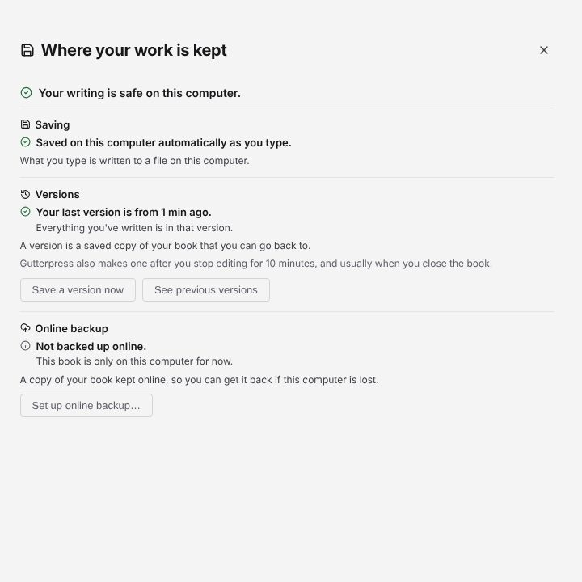
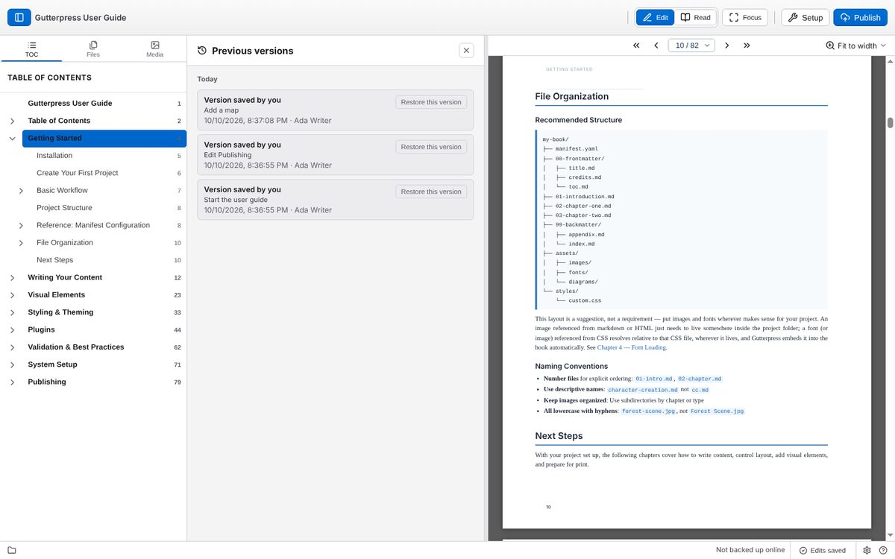

# Keep versions and back up your work

## Where your work is kept

The indicator in the status bar shows whether your edits are saved: **Edits saved**,
**Saving…**, **Unsaved changes** or **Couldn't save**. Click it to open **Where your work is
kept**, which has three parts:

- **Saving** — **Save now** saves immediately.
- **Versions** — **Save a version now** keeps a copy of the book as it is, and **See previous
  versions** lists them. If the book is a plain folder, **Start keeping versions** turns this on.
- **Online backup** — **Back up now** copies your versions to your online backup.

Next to the indicator, a status shows the online backup: for example **Backed up online**,
**Backing up…**, **Not backed up online**, or **Offline — edits are saved on this computer**.

## Go back to an earlier version

1. Click the save indicator, then **See previous versions**.
2. Find the version you want and click **Restore this version**.
3. Confirm with **Yes, restore**. Gutterpress saves your current work as a version first, so
   nothing is lost.

## Back up online

Online backup keeps a copy of your book's versions on GitHub (or another Git server).

1. Connect your account: Settings → **Accounts** → **GitHub** → **Connect GitHub…**, then enter
   the code shown on the GitHub page.
2. A book that already has an online copy, such as one you opened with
   [Open from GitHub](02-books.md#open-a-book-from-github), backs up as soon as you are connected.
   **Setup → Connections** shows its folder, online repository and branch.
3. A book you started on this computer needs an online copy first. See
   [Set up online backup for a book you started here](#set-up-online-backup-for-a-book-you-started-here).

### Set up online backup for a book you started here

You need a connected GitHub account (step 1 above) and version history turned on for the book.

1. Click the save indicator, then **Set up online backup…** under **Online backup**. This opens
   **Setup → Connections**.
2. If the book is a plain folder, click **Turn on version history** first. Online backup copies the
   versions Gutterpress keeps, so it needs them.
3. Under **Set up online backup**, choose where the copy goes:
   - **Create a new repository** — the name starts as your book's title and you can change it.
     **Keep it private (only you can see it)** is on by default.
   - **Use an empty repository I already made** — pick one from the list. Repositories that look empty
     are listed. To make one, click **Open github.com to create one…** and leave "Add a README"
     off.
4. Click **Set up online backup**. Gutterpress connects the book to the repository and copies all
   of its earlier versions there. When it finishes, the status bar shows **Backed up online** and
   the book works like one opened from GitHub.

If something goes wrong, Gutterpress says what happened in plain words and leaves your book as it
was. The common cases:

- **A repository with that name already exists** — pick another name, or choose that repository
  from the empty ones.
- **The repository already has files** — online backup needs an empty one. Choose another, or
  create a new one.
- **No internet connection** — nothing was changed; try again when you are back online.
- **GitHub didn't accept the saved connection** — reconnect under Settings → **Accounts**, then try
  again.
- **The copy didn't go through after the repository was created** — the empty repository is kept
  and selected; click **Try again** to use it.

Settings → **Saving** has the switches: **Save edits automatically**, **Keep previous versions**
and **Keep this book backed up online**.

Next: [settings, updates and getting help](10-settings.md).
