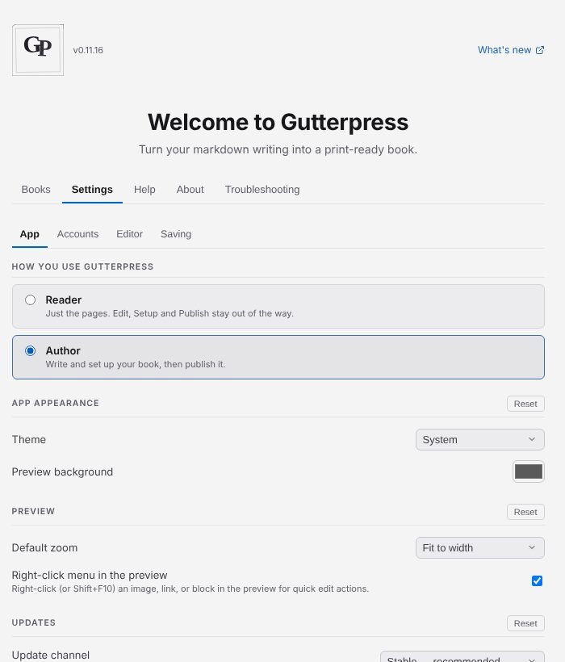

# Settings, updates and getting help

The gear at the right of the status bar (or Ctrl+,) opens **Settings**; the **?** next to it opens
**Help**. Both are tabs of the start screen.

## Settings

- **App** — how you use Gutterpress (**Reader** or **Author**), the **Theme** (System, Light or
  Dark), the preview's background and default zoom, and the update channel. On Linux, **Add to
  application menu** adds the AppImage to your desktop's menu.
- **Accounts** — your name and email, **GitHub**, **Publishing accounts** and Git servers.
- **Editor** — font, font size, line spacing and spell-check language.
- **Saving** — automatic saving, previous versions and online backup (see
  [Keep versions and back up your work](09-versions-and-backup.md)).

## Updates

Gutterpress checks for updates itself and shows **Update available** with a **Download** button,
then **Update ready — Restart & update** once it has downloaded. On a Mac, the update downloads
from GitHub for you to install. To check yourself, open the start screen's **About** tab and click
**Check for updates**.

The **Update channel** under Settings → App is **Stable — recommended** unless you choose **Beta**
or **Alpha** for early builds.

## Get help or report a problem

The start screen's **Help** tab has help on using the app, and these guides are always at
[gutterpress.dimm.city/docs](https://gutterpress.dimm.city/docs/).

To report a problem, open **Troubleshooting → Report a problem**. **Copy report** copies the
details, and **Open GitHub issue** starts an issue with them; nothing is sent until you submit
it. Error messages also offer **Report a problem**. The **Logs** and **Diagnostics** tabs help
when something isn't working.
