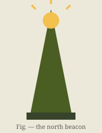

@chapter "Specimen Plates" #ch-specimens

@page plate

# Specimen Plates

Plates run on the tighter `plate` page so the figures breathe. Each
figure exercises one image-placement convention.

{.gp-left .gp-small}

A left-flowed figure at small size: text wraps along its right edge for
as long as the figure runs. The beacon plate is the reference drawing
every district copies, so it appears first and it appears small — the
prose, not the picture, is the instrument of record here. When the text
outruns the figure the wrap releases and the column returns to full
measure, which is exactly what should happen on this plate.

{.gp-bleed}

The ridge panorama runs full bleed: edge to edge, no margin, trimmed at
the page line. Panoramas are the only plates permitted to bleed.

## Measured widths and shapes

{.gp-right width="34%" .gp-shape}

An explicit `width` plus `.gp-shape` floats the knot right and lets the
text follow its round outline instead of its bounding box. Shaped wraps
are reserved for figures whose silhouette is the lesson — knots, horns,
leaf margins — where the square crop would hide the very thing the
plate teaches. The paragraph continues long enough to show the wrap
releasing cleanly below the figure.

{.gp-pin .gp-bottom .gp-right .gp-small}

A pinned figure leaves the text flow entirely: it holds the page's
bottom-right corner regardless of where its markdown line falls in the
source. Corner pins carry the plate stamps and district seals.

## Plate measurements

| Plate | Subject | Sheet | Wrap |
| --- | --- | ---: | :---: |
| P-1 | north beacon | 200 × 260 | flow left |
| P-2 | long ridge | 640 × 300 | bleed |
| P-3 | warden's hitch | 200 × 200 | shaped |
| P-4 | beacon (seal) | 200 × 260 | pinned |
