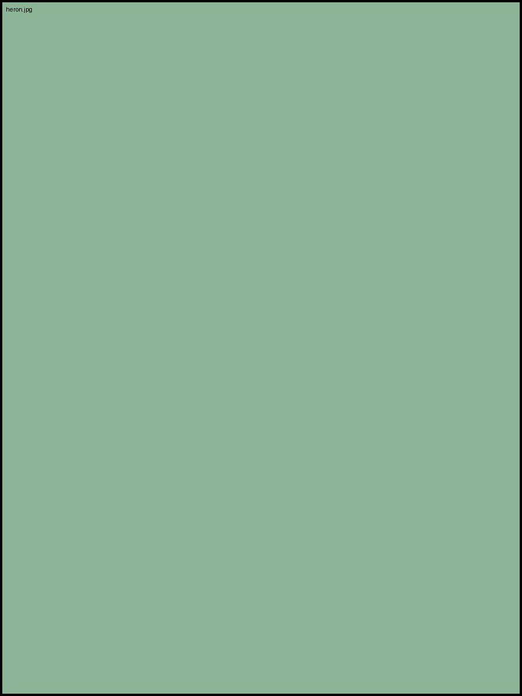

# Pictures in the Flow

The gp-* vocabulary places every image on this page with class names
alone: one word for the position, one for the size, one for the spacing.
Text wraps around the floats exactly where the image sits in the source —
vertical placement is the author's paragraph order, on purpose.

{.gp-right .gp-small}

The marsh reveals itself twice a day. At low tide, mudflats stretch out
toward the channel, pocked with the breathing holes of clams and the
zig-zag tracks of shorebirds. At high tide, the same ground disappears
under a foot of brackish water, and the foraging grounds become a
different place entirely — one you travel by boat, not boot. Learning to
read a tide table is the first skill any forager needs, and the second
is learning to read the light on the water.

{.gp-left .gp-medium .gp-loose}

Coastal almanacs list two high tides and two low tides a day, roughly
twelve hours and twenty-five minutes apart, drifting later each day as
the moon's position shifts. A spring tide — the biggest swing between
high and low — happens near the new and full moon. A neap tide, the
smallest swing, happens at the quarter moons. Timing a trip around a
spring low tide exposes the most ground and the most food: mussel beds
normally submerged, cockle flats normally too deep to reach on foot,
eelgrass meadows where bay scallops shelter in the shade.

## Centered and Full-Width Plates

{.gp-center .gp-medium}

A centered plate sits alone between paragraphs, no wrap on either side.
Wind direction matters as much as the tide chart. A strong onshore wind
can push the actual water level a foot or more above prediction, while a
hard offshore wind can strand a boat that timed its return around the
printed numbers alone. Watch the sky as closely as the table.

{.gp-full}

The full-width plate above spans the page's whole content box.

## Wrapping to a Silhouette

{.gp-left .gp-shape .gp-medium}

Stand at an edge and wait, and the marsh comes to you. Fish, birds, and
foragers all work the seams where fast water meets slow, where mud meets
sand, where the last of the ebb meets the first push of the flood. The
shaped float on the left lets these lines climb its transparent slope
instead of squaring off against the image box, and the wrap must land on
the same lines in the preview and in the printed pages for the parity
gate to stay green. The tide table is a promise the water mostly keeps,
and the wind rewrites it at the margins while the moon signs it twice a
month before the mud files it away under eelgrass until the next low
water opens the book again.
