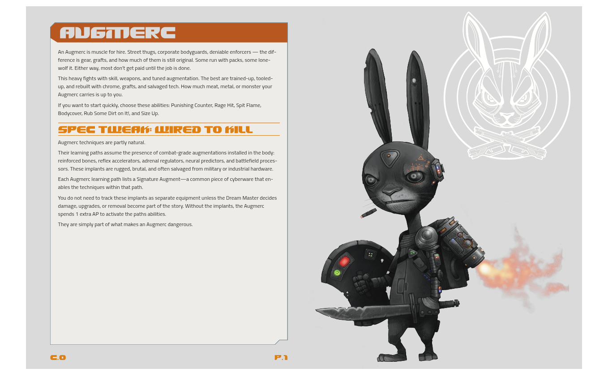

@chapter #ch-reference .reference

# Markdown Reference

<div class="dc-intro">All markdown-it syntax features with live DC examples.</div>

---

## Page Layout Markers

The `@` marker system controls page flow and generates semantic HTML wrappers. Markers accept `#id`, `.class`, and `key=value` attributes, enabling chapter-scoped CSS rules without touching global selectors.

**Full attribute syntax** — `@marker #id .class key=value`

| Marker | HTML emitted | Purpose |
|--------|-------------|---------|
| `@chapter #id .class` | `<div class="chapter [class]" id="id">` | Wraps all following content until next `@chapter` |
| `@page #id .class` | `<div class="page [class]" id="id">` | Explicit page container with a named CSS target |
| `@break` | `<div class="md-break" aria-hidden="true"></div>` | Hard page break without generating a wrapper div |
| `@section #id .class` | `<div class="region [class]" id="id">` | Region block — groups content, avoids page split |
| `@spread #id .class` | `<div class="spread [class]" id="id">` | Two-page spread — keeps left and right pages paired |

**Example usage:**

```markdown
@chapter #ch-augmerc .augmerc

# Augmerc {.dc-chevron}

@page #pg-skills .skills

## Core Skills

@section #sec-counters .counters

### Counter Abilities
```

Chapter IDs enable precise CSS scoping without specificity battles:

```css
/* Only affects the Augmerc chapter's skill tables */
.chapter#ch-augmerc table { table-layout: fixed; }
```

---

## Dimm City Plugin Markers

The Dimm City plugin (`dimm-city-plugin.js`) extends the `@` marker system with game-specific block wrappers. These markers auto-close any previously open block of the same type.

| Marker | Closes on | Purpose |
|--------|-----------|---------|
| `@specialty` | Next `@specialty` or `@end-specialty` | Wraps a full specialty section (name, intro, paths) |
| `@end-specialty` | — | Explicitly closes the current specialty block |
| `@learning-path specialty="name" index="N"` | Next `@learning-path` or `@end-learning-path` | Groups skill cards under a spray header |
| `@end-learning-path` | — | Explicitly closes the current learning-path block |
| `@skill variant="N" id="slug"` | Next `@skill` or `@end-skill` | Starts a skill card; content becomes card body |
| `@end-skill` | — | Closes the current skill card |

**Variant values** — `variant="1"` through `variant="5"` select different clip-path shapes for the card tab.

**Example — skill card:**

```markdown
@skill variant="1" id="punishing-counter"
**Punishing Counter** · AUG1.1

*See an opening, ya take it.*

<span class="ap-tag free">0 AP</span> When an enemy in reach makes a basic attack, your Backbiters knock the strike off line.
@end-skill
```

**Example — learning path:**

```markdown
@learning-path specialty="augmerc" index="1"

@skill variant="1" id="breach-and-clear"
...
@end-skill

@end-learning-path
```

---

## Container Blocks

Triple-colon fences wrap content in a styled `<div>`. The word after `:::` sets the container type; the optional `{.class}` attribute applies additional classes.

**`:::two-column`** — two equal CSS columns with a column rule:

```markdown
:::two-column

Left column content.

---{.column-break}

Right column content.

:::
```

**`:::three-column`** — three narrow columns, best for short reference entries:

```markdown
:::three-column

Alpha · first.  Beta · second.  Gamma · third.

:::
```

**`:::sidebar`** — right-floated aside at 38% width:

```markdown
:::sidebar
**Sidebar note.** Supplementary content that doesn't interrupt the body flow.
:::
```

**`:::callout`** — styled information panel with a labeled type:

```markdown
:::callout
<span class="callout-label">Note</span>
Standard informational callout.
:::
```

**`:::pull-quote`** — large centered excerpt with decorative rules:

```markdown
:::pull-quote
The measure of good design is whether the reader notices the design at all.

<span class="attribution">— Design Guide</span>
:::
```

**`:::wrapper {.class}`** — generic wrapper, applies any CSS class:

```markdown
:::wrapper {.dc-note}
<span class="dc-note-label">Note</span>
<p>Content gets the `.dc-note` class on its wrapping div.</p>
:::
```

---

## Element Attributes

The `markdown-it-attrs` plugin adds `{#id .class attr="value"}` to most markdown elements. The attribute block must immediately follow the element with no space.

**Headings:**

```markdown
## Section Heading {#my-anchor .custom-class}
```

**Images:**

```markdown
{.img-float-right}
```

**Inline spans** — wrap with `**` or `*` then add attributes:

```markdown
This sentence has a **key term**{.custom-span} highlighted.
```

**Live specimen — float right:**

{.img-float-right}

The body text wraps to the left of this floated image. The attribute `{.img-float-right}` is appended directly after the closing `)` of the image syntax with no space between them.

---

## Standard Markdown

All standard GFM features are available. Smart typography is enabled by default.

**Bold** — `**text**` · *Italic* — `*text*` · ***Bold italic*** — `***text***` · `code` — `` `text` ``

**Headings:**

```markdown
# H1 — chapter title (dc-chevron or plain)
## H2 — section heading (accent border-bottom)
### H3 — sub-section
#### H4 — item heading (uppercase small)
```

**Unordered list:**

- First item
- Second item
  - Nested A
  - Nested B

**Ordered list:**

1. Step one
2. Step two
3. Step three

**Blockquote:**

```markdown
> Quote text.
>
> — Attribution
```

**Table:**

| Left | Center | Right |
|:-----|:------:|------:|
| A    | B      | C     |

**Fenced code block:**

````markdown
```language
code here
```
````

---

## Smart Typography

Auto-converts common ASCII sequences to proper typographic characters. No manual Unicode entry required.

| Input | Output | Name |
|-------|--------|------|
| `--` | — | Em dash |
| `---` | – | En dash |
| `...` | … | Ellipsis |
| `"text"` | "text" | Curly double quotes |
| `'text'` | 'text' | Curly single quotes |

---

## Footnotes

Footnotes are supported via `markdown-it-footnote`. References appear inline at the point of use; definitions can be placed anywhere in the file and render at the end of the content flow.

**Syntax** — `[^label]` inline + `[^label]: definition` anywhere in the file.

```markdown
Here is a sentence with a footnote.[^fn-1]

A second sentence references a different note.[^fn-2]

[^fn-1]: The footnote definition. Can go anywhere in the source file.
[^fn-2]: A second, independent footnote. Labels can be numbers, words, or abbreviations.
```

Here is a sentence with a footnote reference.[^demo]

[^demo]: This is the footnote definition. It renders at the bottom of the page in print output and at the end of the content block in HTML preview.
