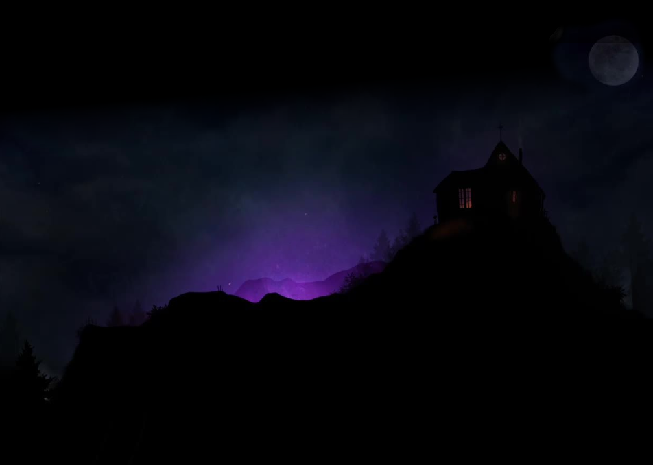
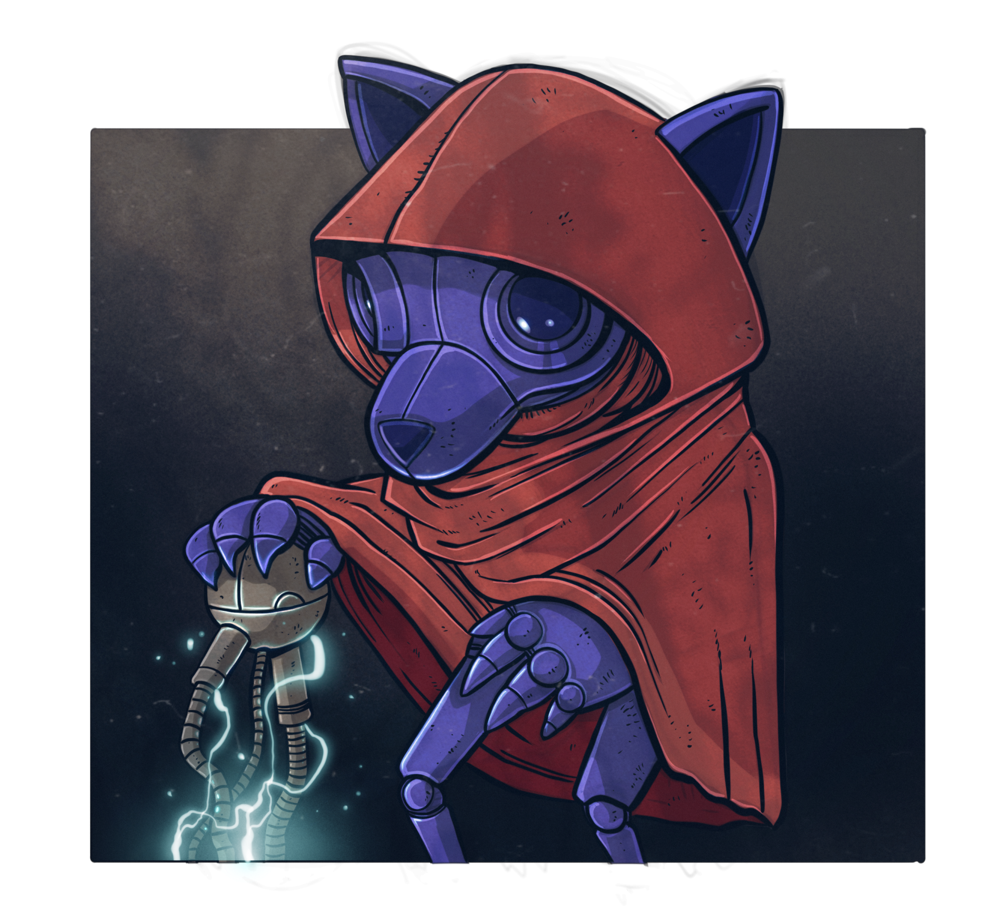

@page .page-toc

# Contents {.dc-chevron}

@lede

Twelve chapters of dreams, dirt, and what bites back. Read them in any order — the city doesn't care where you start.

@end-lede

@toc

1. Who Do You Dream to Be? — Citizen file, vibe, origins, ideals, flaws.
2. What Do You Dream of Doing? — How abilities work. Choose a specialty.
3. The Augmerc — Muscle for hire. Backbiters and worse.
4. The Proxy — Bodies for hire. Divine force as a weapon.
5. The Streetwarden — The closest thing to law in the alleys.
6. The Gutterdruid — Sacred ground in broken pavement.
7. The Cybersurgeon — Cutting, splicing, upgrading flesh.
8. The Wirephreak — Killers, thieves, forgers — clean or loud.
9. The Technosorcerer — Code that bites. Magic with root access.
10. The Etherlock — Secrets as currency. Power has a price.
11. Are You Lucid Yet? — Core rules, scenes, distances, rolling the die.
12. Dream Mastery & Cosmology — NPCs, traits, time, districts.
13. Cybernetics, Weapons, and Gear — Useful items, tech, blasters, blades.

@end-toc

@page .page-credits .credits

# Credits {.dc-chevron}

@section .credits-colophon

**Designers:** TWard and ITLackey

**Artist:** Scott Georges

**Creative Director:** Matt Pini

**Editing & Layout:** Dimm City Field Office

**Cover & Interior Design:** Founders House Studio

**Play Testers:** Malie Mason, Ceros Whaley, Lady Lunadi, Owen Benjamin Kessel, Tim Kirk, Xander Arth, Thomas Morton, Ian Cooper, Colin Campbell, Chris Mayes, Jesse Rhom, Toby Dillon, Tim Peludat, Lane Francis, Adam Martin, Clay Meyer, Luther Krupp

**Special Thanks:** Don and Cindy Ward, Ted Bonnah, Joseph Woodworth, Ben McDonough, Michael Giordono, Adam Tripp, Nathan Hays, Nathanael Elkins, Chelanna Leigh, Thomas Amundrud, Virgina Horine, Gena Pini, Madeleine Pini, Ken Pini, Mary Jo Pini, Davide Cavadini

**Dedicated to the memory of Donovan Henry Callender.** Don was a player in our 2E AD&D group throughout our youth and was a dear friend for even longer. He was taken too soon from us and we wish he were here to dream in Dimm City with us today.

**Typography:** Bebas Neue (display) · Special Elite (typewriter) · Inter (body) · JetBrains Mono (data). All faces open-licensed and self-hosted.

**Safety Tools:** This game uses Lines & Veils, the X-Card, and Script Change. Establish boundaries at session zero. The full safety toolkit lives at dimm.city/safety.

**Edition & ISBN:** First Edition · Version 0.1.x · ISBN pending. Printed on demand via DriveThruRPG and Founders House direct.

**Trademarks:** Dimm City, the Creaturepunk wordmark, and the chevron mark are trademarks of Founders House. © 2026 Founders House. All rights reserved.

**Published by Founders House · Dimm City · 2026.**

{.fg-art-founders-house}

---

@page .page-intro .intro

# Introduction {.dc-chevron}

@lede

The city didn't go quiet—it got loud. That feline snarl tore through the alley speakers, chased hard by the thundercrack of gunfire. A crew of geared-up cats—sleek fur, feral eyes, lenses pulsing with kill-code—came screaming down the block, pulse cannons humming an evil dirge.

@end-lede

@section

> [!PULLQUOTE]
> "How bright's it ay?!"

{.fg-art-intro-image}

They wore glossy slab-armor that flexed like chitin and burned like synthlight. Opposite them? A pack of ragged rabbits with wiry limbs and twitch-fast reflexes, zipping through the sprawl with street-born magic and muscle memory. Then the world erupted.

Blasts lit the dusk like glitchfire. Bolts and teeth and claws tangled mid-air. Neon signs cracked. Alleyways bled smoke. Debris rained in bursts. This wasn't about glory—it was turf. It was pride. It was blood memory, raw and ugly, of family torn away by their rival.

DimmCitz scattered, vanished into bolted dens and reinforced rooftops. Some just slinked into a corner, shut their eyes, and hoped the riot passed them by. The air stank of scorched fur, ozone, and cordite. Concrete buckled under pulsefire and the ground groaned like it wanted no part of any of it.

@end-section

@section

## Metropolis in the Mist

Dimm City is a place of crushing lows and exuberant highs known to all within. The citizens of the five districts commonly refer to each other as "Dimmers". Light is impermanent, as just as darkness is, but both are in constant flux. Life in DimmC is the same.

You and your party make the dream come alive. Without you, it doesn't exist. The point that differs in this dream is when you enter Dimm City, you all can share in the story together, shape events, and even change the demi-plane itself permanently.

These dreams you share will last in your consciousness for life. The joys you found and the laughs you shared coupled with tragedy, sadness or even guilt can impact you in unexpected ways. Be "ready 'n' wary" as adventure in Dimm City is hard, fast, and not for the faint of heart.

@end-section

@section

## CREATUREPUNK

It ain't chrome. It ain't clean. It's coagulated blood in the wire, hairballs in the circuitry, a roar tearing through static.

Creaturepunk is what happens when evolution takes a sledgehammer to the face and the survivors crawl out growling. You're spliced-up, hex-stained, glitch-ridden—a freakshow stitched with spite, magic, and tech from dead wars. You're anything but human. Your kind's been running the monoverse since before humanity finger-painted on cave walls.

The city don't love you. The corps don't see you. The gods don't pick up.
Good. That makes you dangerous.

This is a genre where dreams are loud, limbs are optional, and survival's the last sacred act.

Welcome to Creaturepunk. Get weird or get wrecked.

@end-section
